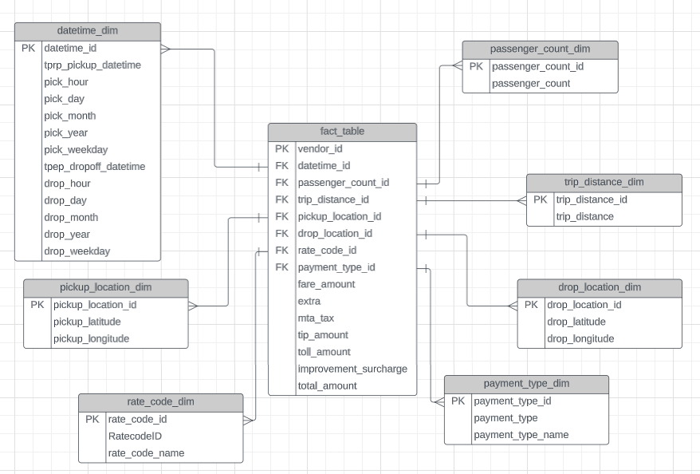

# Uber-Mage-data-Analysis

## Introduction
The goal of this project is to perform data analytics on Uber data using various tools and technologies, including GCP Storage, Python, Compute Instance, Mage Data Pipeline Tool, BigQuery, and Looker Studio.

## Architecture

## Technology Used
- Programming Language - Python
- Google Cloud Platform
- Google Storage
- Compute Instance
- BigQuery
- Looker Studio
- Modern Data Pipeine Tool - https://www.mage.ai/

## Dataset Used
TLC Trip Record Data Yellow and green taxi trip records include fields capturing pick-up and drop-off dates and times, pick-up and drop-off locations, trip distances, itemized fares, rate types, payment types, and driver-reported passenger counts.

Website - https://www.nyc.gov/site/tlc/about/tlc-trip-record-data.page

Data Dictionary - https://www.nyc.gov/assets/tlc/downloads/pdf/data_dictionary_trip_records_yellow.pdf

## Data Model

